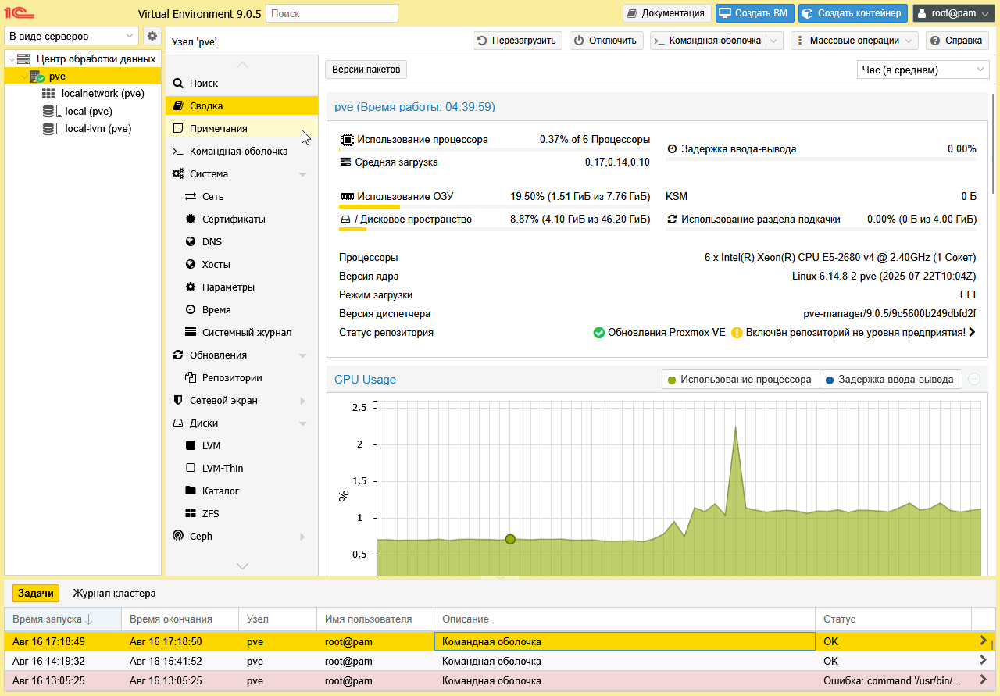

## Описание
Самый обыкновенный фановый мод Proxmox в стиле 1С. На данный момент не самый стабильный, но вполне адекватно смотрится на светлой теме.

## 🚀 Установка
1. Скопируйте папки `css` и `images` в директорию proxmox-manager: /usr/share/pve-manager/
2. Перезапустите веб-интерфейс Proxmox:
```bash
systemctl restart pveproxy
```
3. Если тема не применяется, попробуйте во вкладке с Proxmox нажать **Ctrl + F5**, или переустановите pve-manager: ```apt install --reinstall pve-manager```

## Скриншоты


> **⚠️ Дисклеймер:**  
> Данный проект не связан с компанией **1С**.  
> Все материалы сделаны в шутливой форме, исключительно в личных целях,  
> и не имеют целью надсмехательство или извлечение прибыли.
